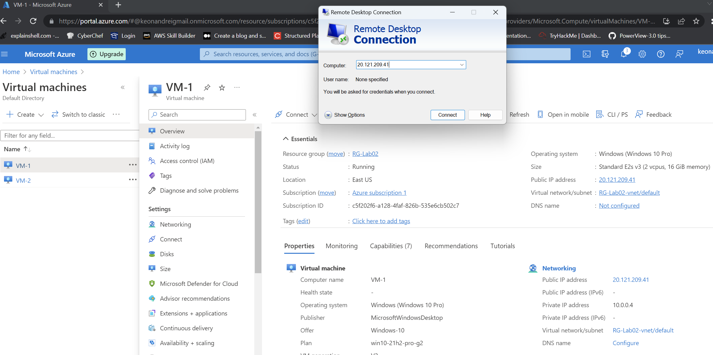
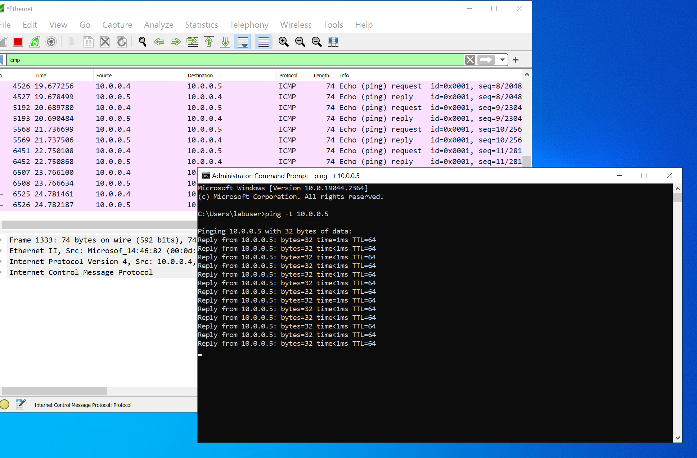
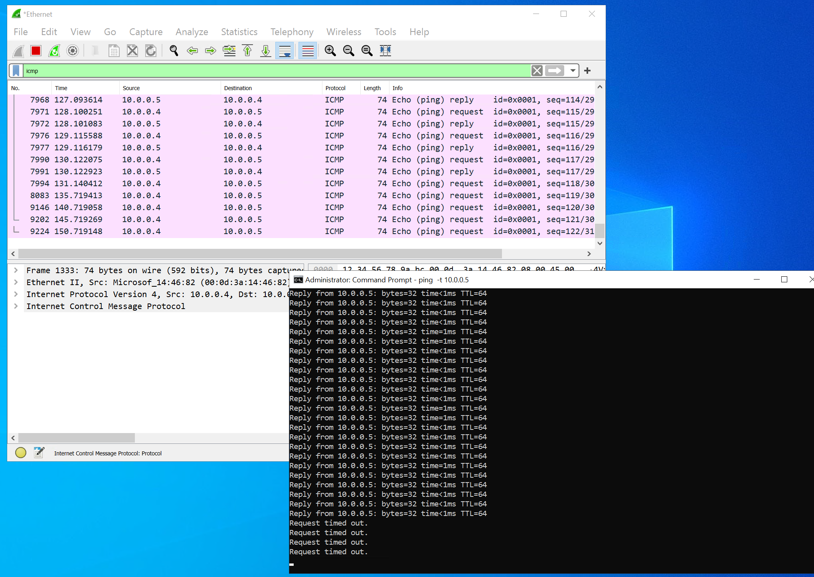
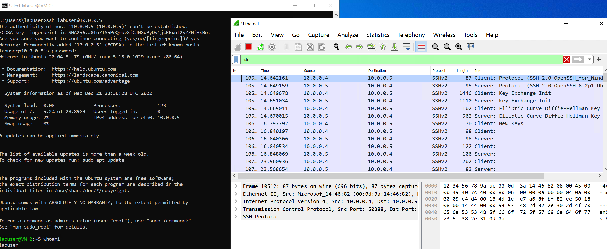
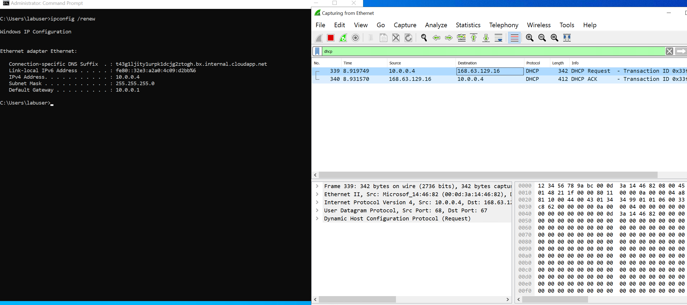
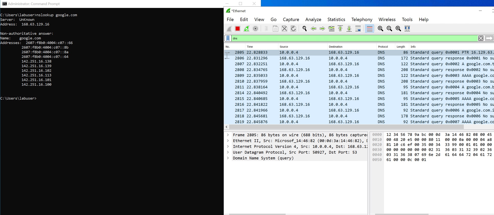
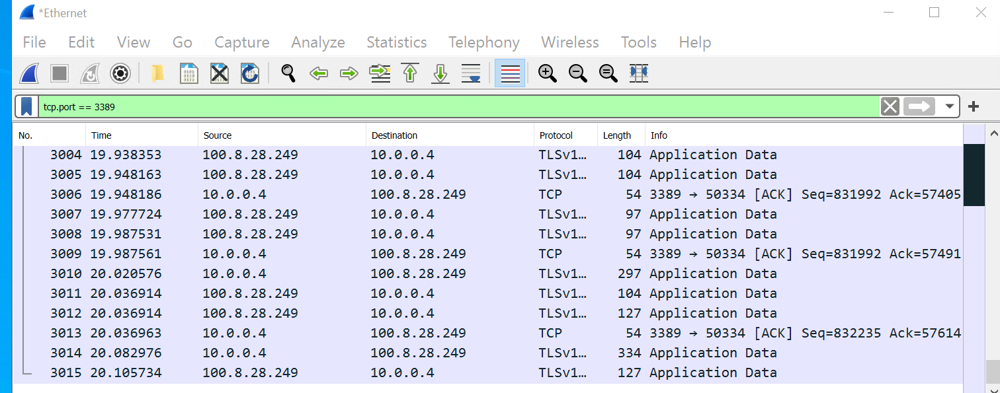

<h1>Network Security Groups (NSGs) and Inspecting Traffic Between Azure Virtual Machines</h1>
In this tutorial, we observe various network traffic to and from Azure Virtual Machines with Wireshark as well as experiment with Network Security Groups.  

<h2>Environments and Technologies Used</h2>

- Microsoft Azure (Virtual Machines/Compute)
- Remote Desktop
- Various Command-Line Tools
- Various Network Protocols (SSH, RDH, DNS, HTTP/S, ICMP)
- Wireshark (Protocol Analyzer)

<h2> Deployment Steps of Resource Group and Virtual Machines </h2>

- Step 1: Once logged in Azure home portal. Go to resource group page and create a resource group
- Step 2: Go to Virtual machine and click Create, choose Azure Virtual Machine. the first Virtual Machine(VM) with Windows 10 Pro.
- Step 3: Under resource group, choose the previously created resource group. Under image, choose windows 10 pro(free eligible services).Under authentication, choose password and fill in the
 rest of required boxes.
 Make sure to check the licensing agreement box.
- Step 4: Go to the Networking tab and there should be a Virtual network, Subnet, Public IP automatically configured. Leave everything else as it is.
- Step 5: Click Review + Create, then create the vm and wait for the deployment to be finished.
- Step 6: Repeat steps 2-5 to create a 2nd Virtual Machine, except change the Image to Ubuntu Server 20.04 LTS (free service eligible)

<h2>Connect to RDP, Use Wireshark for traffic capture and configure network security group</h2>

Go to the start menu and type in and click remote desktop protocol, then go to Virtual Machines(VM) and click on VM-1 to view the Public IP address. Use the Public IP address to connect to the VM via remote desktop protocol and enter the credentials to login. Once logged in, open up a web browser and search for Wireshark, Download the Windows Installer(64-bit) and install the application.

Go back to your azure portal and look for the private IP address of VM-2. Go back to the VM-1 RDP and open up wireshark. Open up the command line in the start menu and type in "ping -t 'VM-2 private ip address here'".
Go back to wireshark and click on the blue icon at the top left to start capturing traffic, and type in "icmp" to specify capturing of ICMP protocol which is used by the ping command.

 

Go back to the azure portal and search for network security groups and we'll set up a inbound security rule for ICMP which will block any traffic from ICMP protocol. 
click on VM-2 network security group then click on inbound security rules and click add. Change the protocol to ICMP  and it should automatically change the Destination port ranges to "*".
Change the  Action to "Deny" and priority to 200, then rename it to deny-icmp and click add. 

  

Notice that the usual reply and request pattern will change to only request, which means that denying the ICMP protocol have been successfully implemented because of the inbound rule setup.

 

Type in ssh in Wireshark, go back to the command line and stop the ping by pressing "Ctrl+C". You will connect to VM-2 via SSH by typing in 
"ssh username@'VM-2 private IP address here'" and enter the credentials. Note that the ssh will not show the characters being typed in while entering the password but it is inputting the characters.
Once logged in you can go back to Wireshark and notice the encrypted packets being captured. That's because SSH is a secure connection.

 

Exit SSH by typing exit. You will now test the DHCP protocol so go ahead and type in DHCP in Wireshark. In the command line type in "ipconfig /renew" which will assign
a new IP address via DHCP and you should see the traffic be captured in Wireshark. 

  

Type DNS in Wireshark and go back to the command line. Use "nslookup www.google.com" and it should retrieve information about the IP address, servers, names of the
 website, which is the purpose of DNS(Domain Name System). 

 

To capture the traffic of RDP(Remote Desktop Protocol), which is what you're using to connect to the VMs, type in tcp.port == 3389 in Wireshark. 
You will notice that it will start spamming traffic since RDP is still being used.

