

<h1>Active Directory Deployed in the Cloud (Azure)</h1>
This tutorial outlines the implementation of on-premises Active Directory within Azure Virtual Machines. 

<h2>Environments and Technologies Used</h2>

- Microsoft Azure (Virtual Machines/Compute)
- Remote Desktop
- Active Directory Domain Services
- PowerShell

<h2>Operating Systems Used </h2>

- Windows Server 2022
- Windows 10 (21H2)

<h2>Setting up Active Directory, Creating Organizational Units(OU), Groups, and File Sharing/Permissions</h2>

Create a resource group and 2 Virtual Machines(VM) within the resource group. A Windows 10 Operating System(Name it client-1) and a Windows Server(Name it DC-1) for Active Directory. Note:If you don't know how to deploy Resource Groups and Virtual Machines then
check out my tutorial <a href="../azure-network-protocols/README.md">here</a>
 

Go to virtual machines -> click on DC-1 VM ,on the networking tab click the NIC -> Click IP configurations, click the ip address at the bottom and change it to Static Assignment.
Login to Client-1 -> Open the command line then use the command "ping -t 'DC-1 IP address here'" to check the connection
 

Login to DC-1 -> Type wf.msc in start menu and open it -> Click on inbound rules and enable rules for ICMPv4 by right clicking the rule and choosing enable

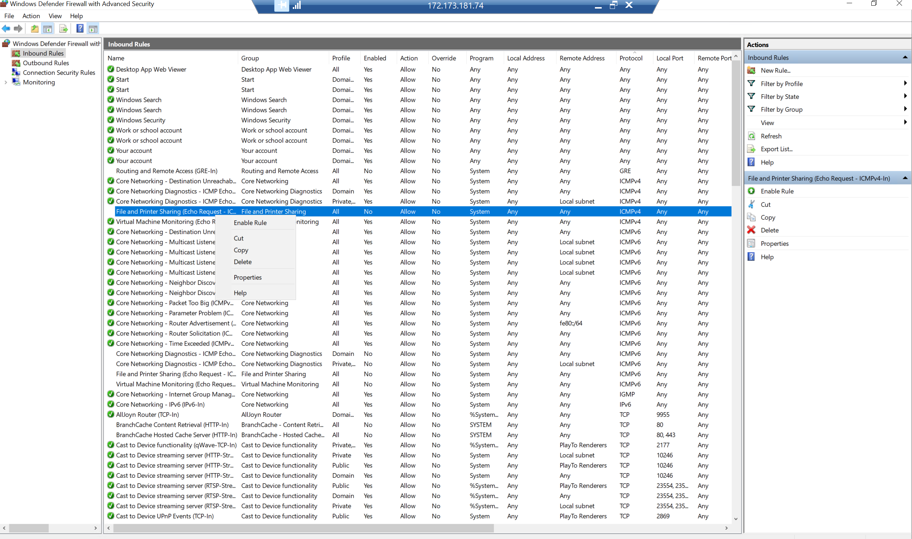 

We're going to start setting up the Active Directory. Open server manager and click on add roles and features -> install Active Directory Domain Services under the Server Roles, leave everything as default and install

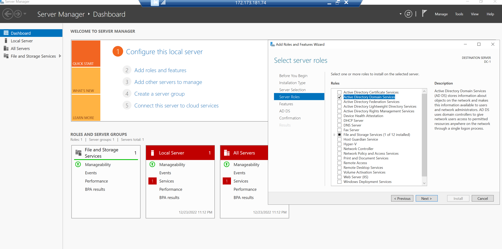 

On the top right you will see a flag icon, click it and select "Promote this server to a domain controller" -> choose Add a new forest and name it "mydomain.com" -> Fill in the credentials > Leave the rest as default then install. You will be logged out. Log back in to DC-1, now you have to use "mydomain.com\username' as the username.

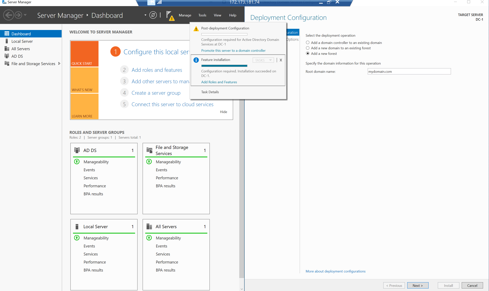 

Click Tools on the top right corner of server manager -> Select Active Directory Users and Computers -> Create an organiztional unit called "_EMPLOYEES" and "_ADMINS"

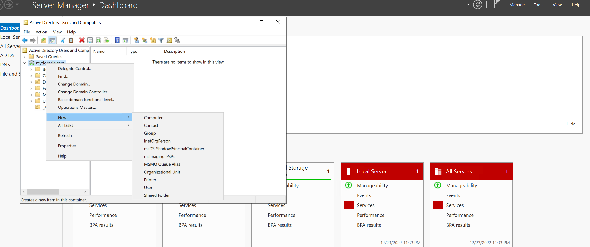 

Go to admins and right click and choose new -> User -> Create a user that we'll give admins privileges. Right click the new user and choose properties -> Member of tab -> add -> Domain then checknames, and choose domain admins -> login as that new user

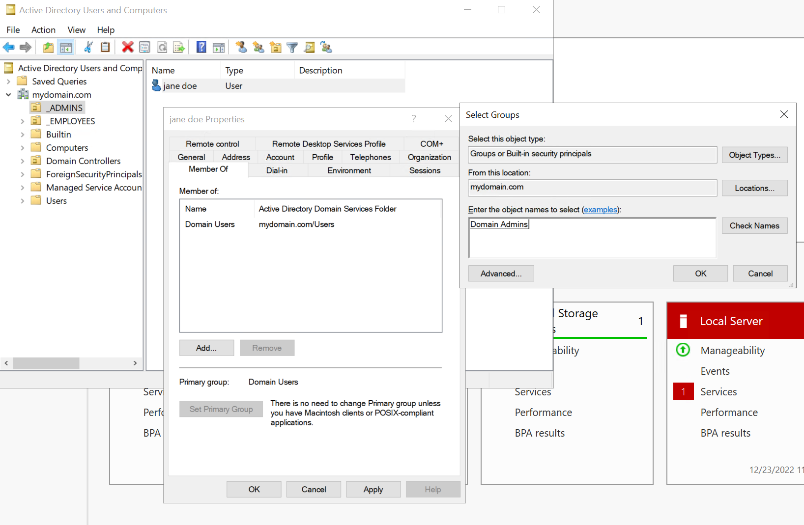 

Go back to azure portal to view client-1 -> Set the DNS to DC-1's private IP address under Networking -> NIC -> DNS servers -> Custom and put DC-1's private ip so that we can connect to the DC-1 active directory.
Go back to client-1 VM -> Right click the start menu and choose systems -> rename this pc -> under computer name choose change -> Use the mydomain.com(DC-1 domain name) 
-> When it asks for account permission use the admin account previously created for DC-1 and the vm will restart. Login to Client-1 with the domain admin account -> Right click the start menu -> system -> remote desktop on the right side -> Select users that can remotely access this pc -> add -> domain users then check names- > Click ok

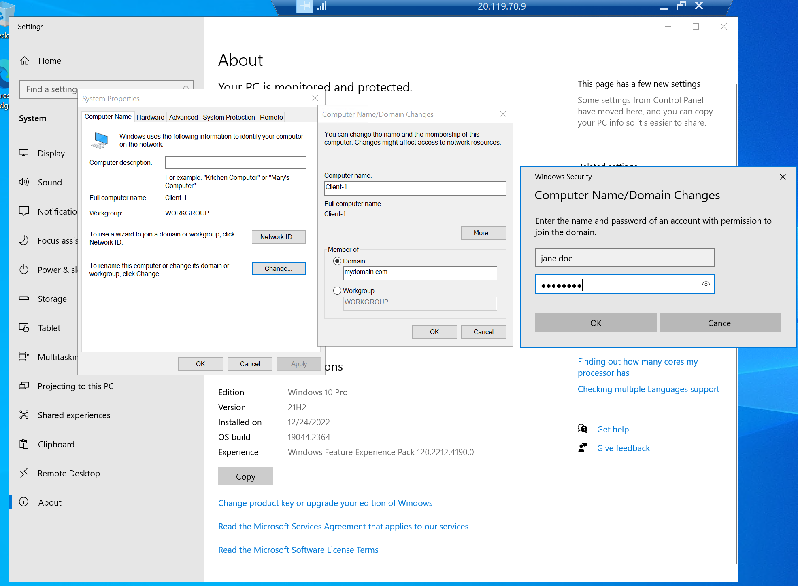 

Go back to DC-1 and make sure you're logged in as the admin account -> Click start menu and type in pwershell_ise -> Right click and choose run as administrator -> New file
 -> Run the script and you will see the accounts get created under employees OU of active directory

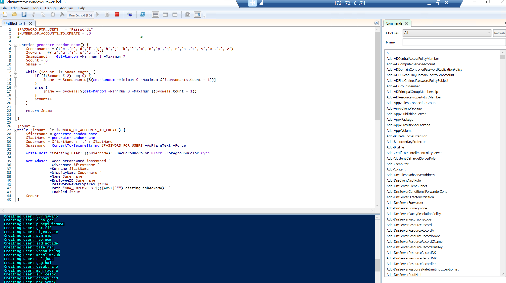 

On DC-1, create 4 folders on C:\ "read-access" "write-access" "no-access" "accounting". Give Domain Users read permission for "read-access, read/write permission for "write-access", and Domain admins read/write permission for "no-access".
To do this, right click on the folder -> Select properties -> Sharing -> Share -> Add domain users -> share. 

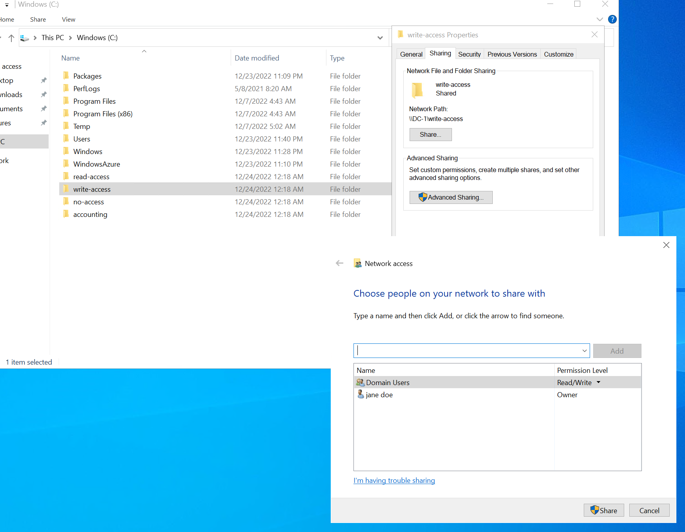 

Connect to client-1 as non-admin user. Go to file explorer and type in "\\dc-1" in the path. You will see the folders shared and notice that you can open the "read-access" folder but can't create a file.
 You can both open and create a file in "write-access" folder. No access for the  "no-access" folder since only domain admins have permissions for it.
 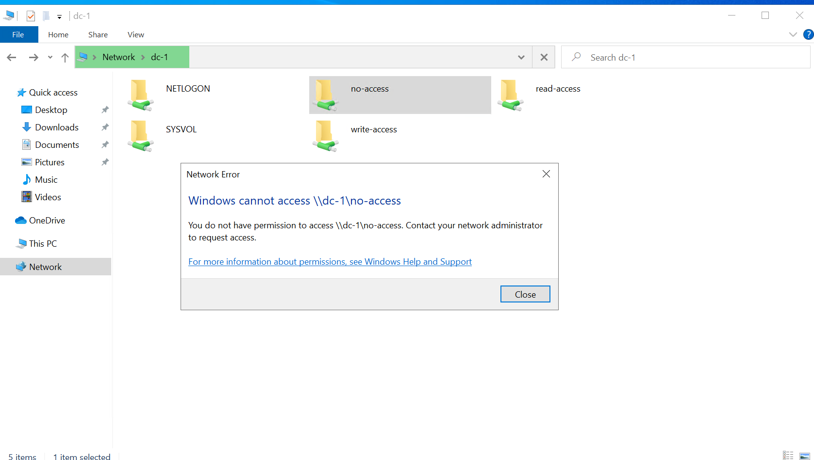 

 
Go back to dc-1 create an accounting folder in C:\. Create an accountant OU -> Right click > New > Group > Name it Accountants and leave everything as default. Set new sharing and permissions for the accounting folder. Go to C:\ -> accounting folder -> Sharing -> Share -> Accountants -> Add ->  Read/write permission

 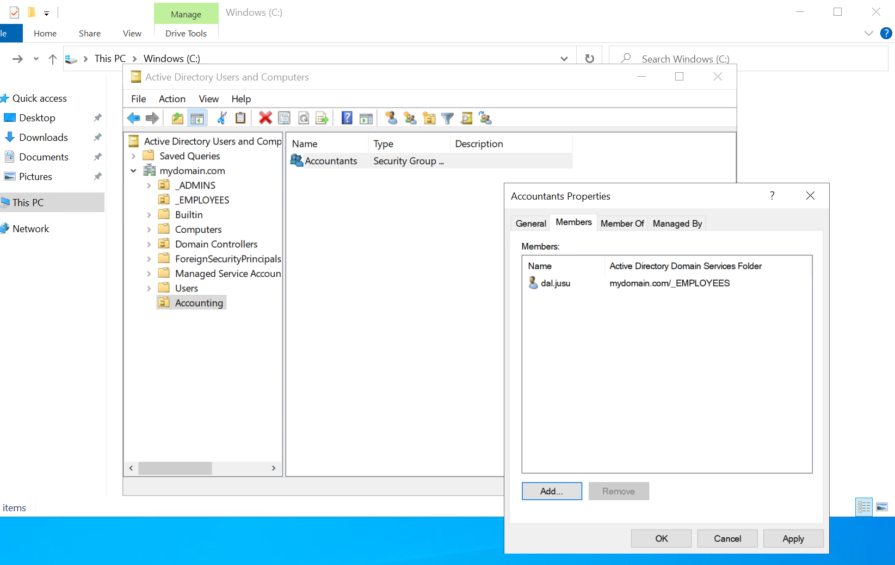  

 
Go back to client-1 and try to open the accounting folder and it should fail since we did not give any non-admin users any privileges yet as part of the "Accountant group". Go back in DC-1 and go to the active directory users and computers -> Accountants -> Double click the group > Members > Add the user logged in client-1. In client-1, log out and log back in with the same non-admin user and you should be able to open the accounting folder. 

 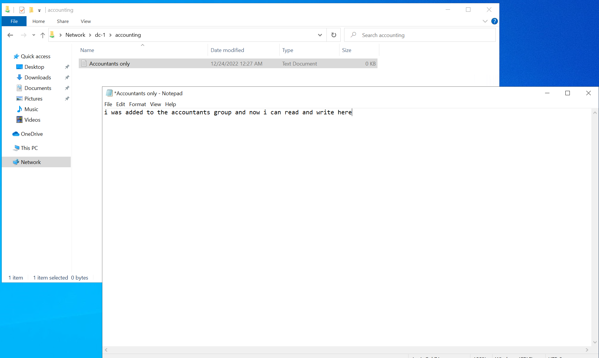