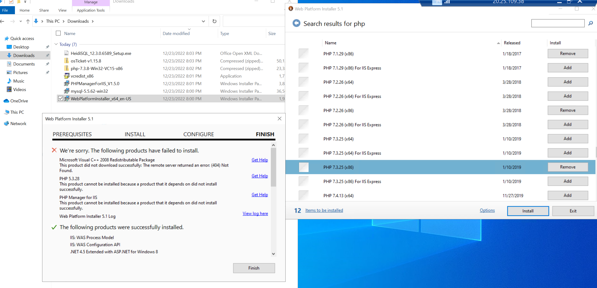
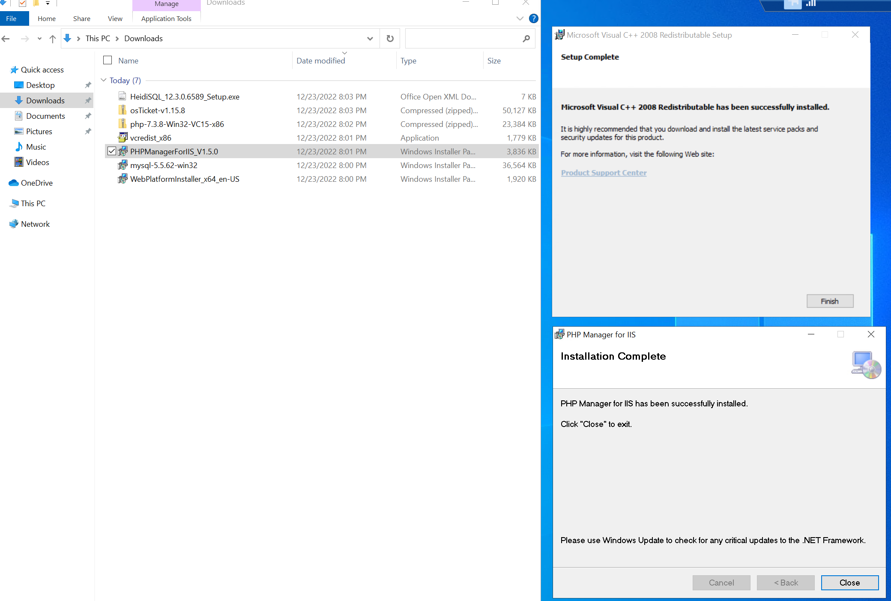
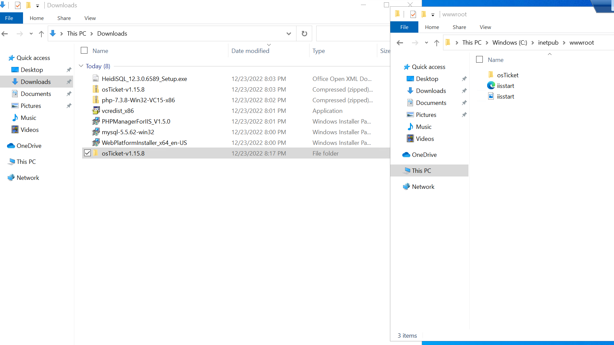
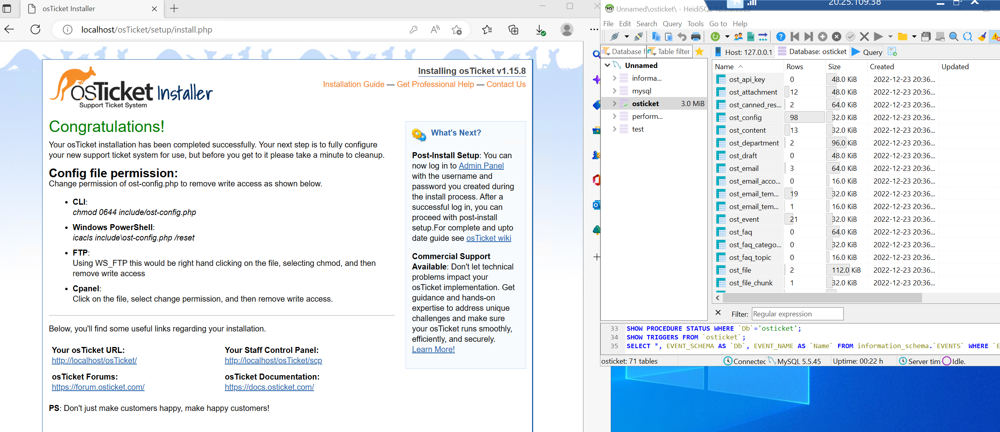

<h1>osTicket - Prerequisites and Installation</h1>
This tutorial outlines the prerequisites and installation of the open-source help desk ticketing system osTicket. 

<h2>Environments and Technologies Used</h2>

- Microsoft Azure (Virtual Machines/Compute)
- Remote Desktop
- Internet Information Services (IIS)

<h2>Operating Systems Used </h2>

- Windows 10</b> (21H2)

<h2>List of Prerequisites</h2>

- Web Platform Installer
- Microsoft Visual C++
- PHPManagerForIIS_V1.5.0
- osTicket Installer
- HeidiSQL

<h2>Installation Steps</h2>

Note: If you don't know how to create and connect to a Virtual Machine then follow my tutorial <a href="../azure-network-protocols/README.md"> here </a>

Create resource group and virtual machine. Connect to the Virtual Machine(VM) via RDP> Install Web Platform Installer and open, then add MySQL 5.5 and All simple versions of x86 PHP until 7.3

  

Download and install Microsoft Visual C++, PHPManagerForIIS_V1.5.0 since it fails on the installation for web platform installer. 

  

Download and install osTicket, then extract and copy the "upload" folder to "c:\inetpub\wwwroot> Within c:\inetpub\wwwroot". Rename "upload" folder to "osTicket" 

  

Open IIS from start menu, click the restart button located on the right side. Go to "sites" folder, click "default web site", click osticket and click "browse 80" on the right side 

  

On the osTicket folder choose PHP Manager, click enable or disable an  extension at the bottom. Enable php_imap.dll, php_intl.dll, php_opcache.dll. Go back to browser, refresh the page, and you will see the Intl Extension be checked 

 

Rename: ost-config.php from C:\inetpub\wwwroot\osTicket\include\ost-sampleconfig.php to C:\inetpub\wwwroot\osTicket\include\ost-config.php 

  

Assign permissions for ost-config.php, right click the file then go to properties and security tab -> click advanced -> choose Disable Inheritance -> select remove all -> click add -> select a principal
-> type everyone and check names -> check full control then select ok. Go back to the browser and click continue, fill in Helpdesk Name, Default email, Admin user.

 

Download and Install HeidiSQL -> open heidisql -> click New, choose a password and click open > right click the new session on the left -> select create new database and fill in the name.
Go back to the browser and fill in the MySQL Database with the new database previously created. Fill in the credentials used for database setup and click install now.

  

The last step is to delete C:\inetpub\wwwroot\osTicket\setup > Set Permissions to Read and read&execute only C:\inetpub\wwwroot\osTicket\include\ost-config.php

  