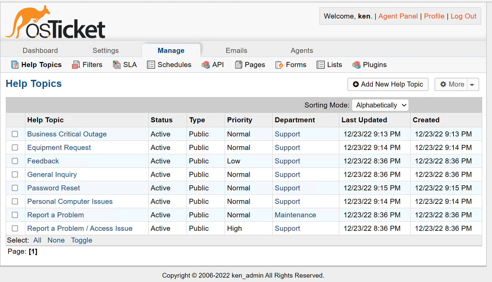

<h1>osTicket - Post-Install Configuration</h1>
This tutorial outlines the post-install configuration of the open-source help desk ticketing system osTicket. 

<h2>Environments and Technologies Used</h2>

- Microsoft Azure (Virtual Machines/Compute)
- Remote Desktop
- Internet Information Services (IIS)

<h2>Operating Systems Used </h2>

- Windows 10</b> (21H2)

<h2>Post-Install Configuration Objectives</h2>

- Create Roles, Teams, Deparments, Agents, Users
- Configure SLA, Help Topics
- Allow everyone to create tickets

<h2>Configuration Steps</h2>

Note: If you haven't installed osTicket yet, follow my instructions <a href="../osTicket-prereqs/README.md"> here </a> 

Open a web browser and navigate to the loginpage "localhost/osTicket/scp/login.php" and to open a ticket for users, it's "localhost/osTicket". To configure Roles, go to admin panel -> select agents -> select roles and add a new role for an admin role that have all permissions.

 

To configure Department. Go to admin panel -> select agents -> select Departments -> select Add New Department and name it System Administrators, leave everything as Default then save.

 

To configure Teams. Go to Admin Panel -> Select Agents -> select Teams -> Select Add New Team > create Level I and level II support Teams

 

To allow anyone to create tickets. Go to Admin panel -> Select Settings -> select User Settings then make sure the box is unchecked for Require registration and login to create tickets.

 

To configure Agents(workers). Go to Admin Panel -> Agents -> Select Add New Agent and create 2 new agents -> Uncheck the box for pass reset for lab practice purposes -> Make sure the first agent has an admin role ->
 select Department, Role, Teams, and extended access as support then select create -> Make the 2nd agent in support department and view only role, choose support for extended access then select create.

 

To configure Users(customers). Go to Agent Panel -> Select Users -> Add 2 New User -> Fill in the email and name then add user

 

To configure SLA. Go to Admin Panel -> Under Manage tab, choose SLA -> Add 3 New SLA Plan -> Name the SLAs SEV-A(put in 1 hr grace period, and 24/7 schedule), SEV-B(put in 4 grace period and 24/7 schedule) , SEV-C(Put in 8 hr grace period and mon-fri 8am-5pm schedule).

 

Configure Help Topics. Go to Admin Panel > Under Manage tab choose Help Topics > Select Add New Help Topic and create 4 > Name them Business Critical Outage, Personal Computer Issues, Equipment Request, Password reset. 

