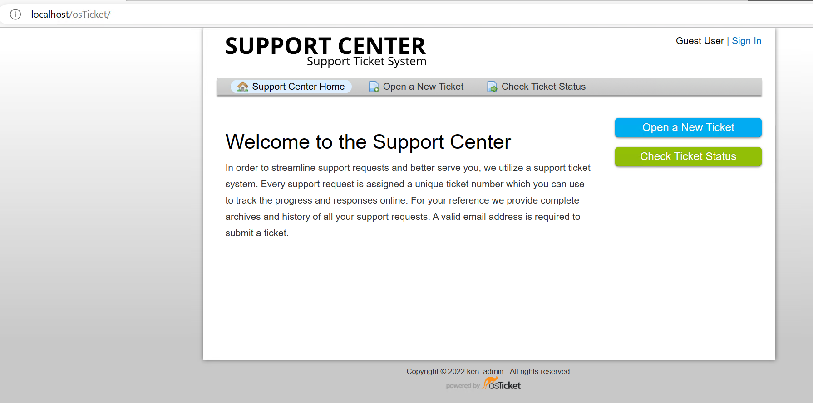
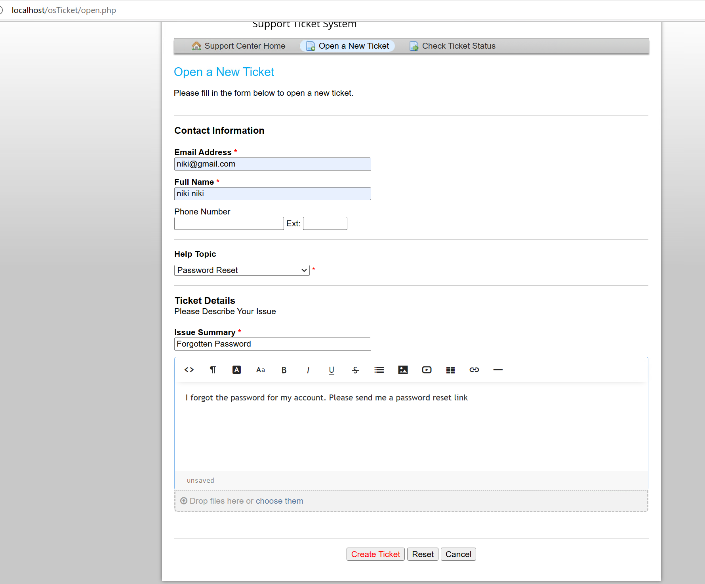
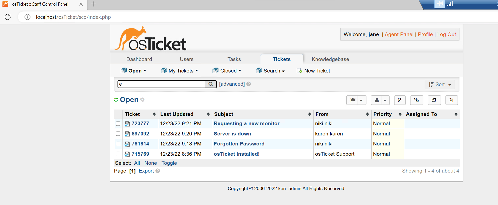
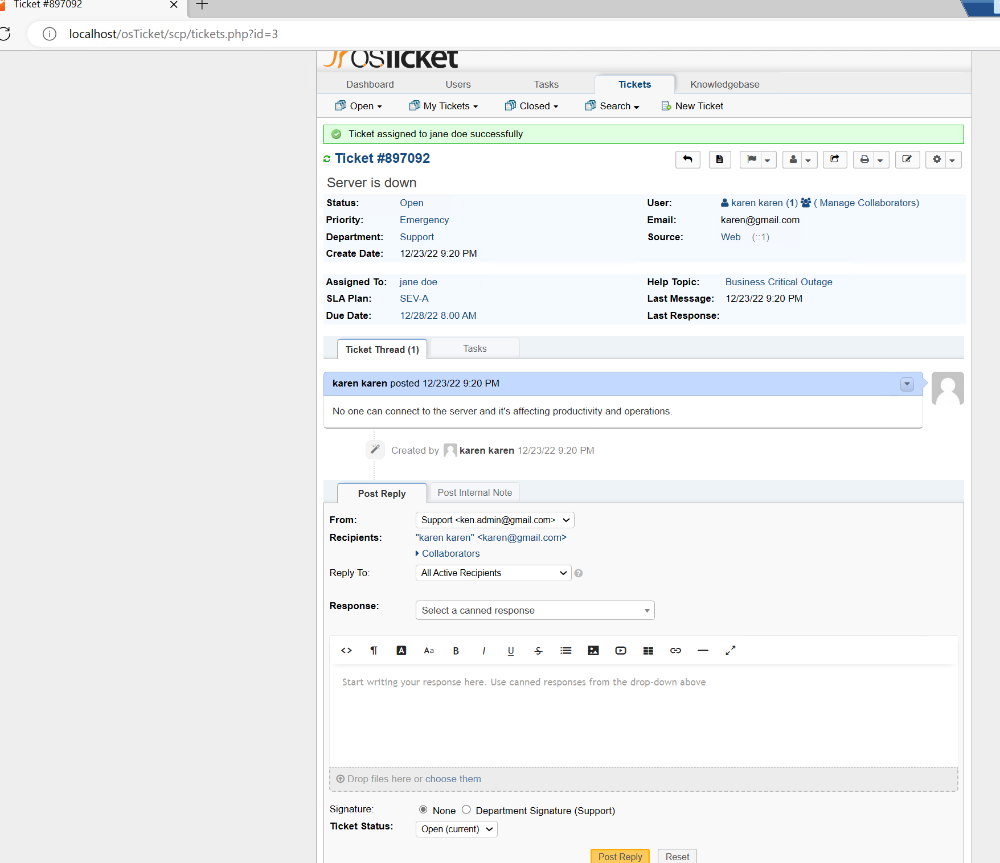
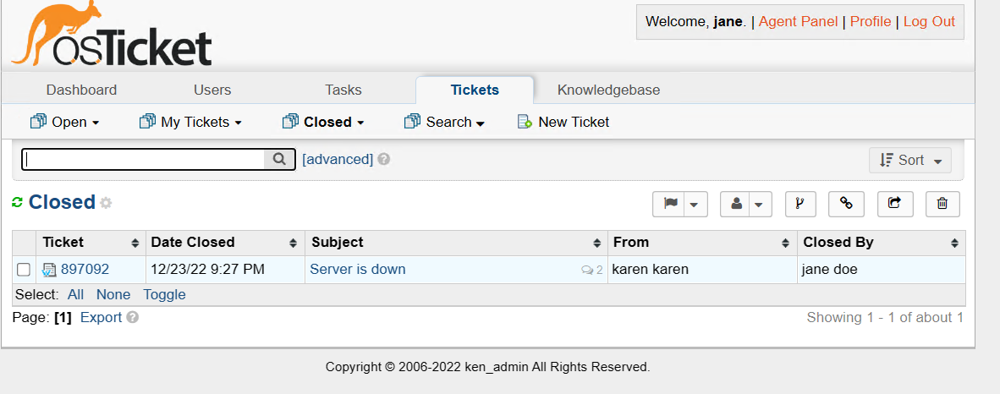

<h1>Opening, Resolving, Closing Tickets- osTickets</h1>

<h2>Environments and Technologies Used</h2>

- Microsoft Azure 
- osTicket
- Virtual Machines
- Remote Desktop
- Internet Information Services (IIS)

<h2>Operating Systems Used </h2>

- Windows 10 Pro</b> (21H2)

<h2>How Tickets are created, modified, and solved</h2>

-Go to the support center of ticketing system "localhost/osTicket" -> select open a new ticket and fill in the required boxes, choose a help topic, issue summary and put something in details -> create select ticket.
Repeat this step twice but with a different user, help topic, issue summary.

 

Log into the ticketing system as an agent of osTIcket with admin privileges -> click the Tickets tab -> Choose the open ticket option.
 

View one of the tickets -> You can see the report in the ticket thread tab. You can change the priority depending on how critical the ticket is in the priority section. You can assign a ticket to an agent in the "assigned to" portion. You can change the SLA Plan in the "SLA Plan". You can change the Department in charge under "Department". You can also reply to the customer via the post reply tab to keep them updated, and also change the ticket status when it's resolved.

 

Closed tickets can still be viewed under the Closed option.
 

